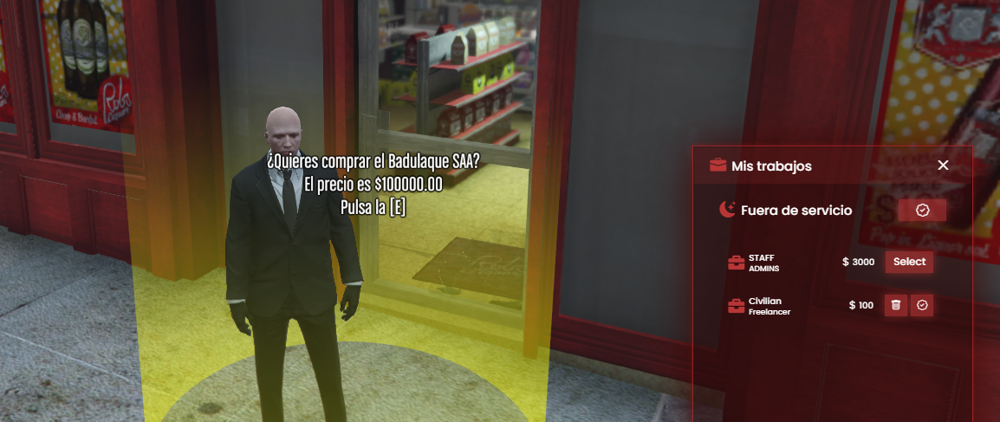
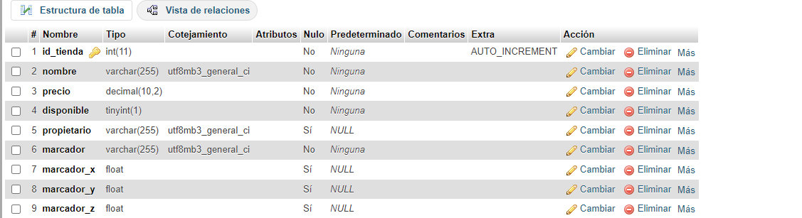
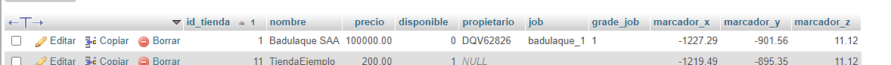

# StoreCommerce V1.0 by Farid Amagua




## Instalación
1. Copia la carpeta del script y pégala en la ubicación donde tengas los scripts del servidor.
2. Crea en la base de datos la tabla necesaria para el funcionamiento del script.
3. Recarga el plugin para aplicar los cambios realizados pulsamos F8 para abrir la consola de administración y ponemos escribimos "restart StorreCommerce-v1.0"

## Configuración
config.lua
En este archivo, especifica los nombres, precios, trabajos (compatibles con NS_JOB), y niveles requeridos para las tiendas. Puedes encontrar más detalles en serve.lua en la función ply.Functions.SetJob(_job,_gradejob).

Este script está diseñado para funcionar con trabajos y roles utilizando el plugin NS multijob para simplificar la gestión. Si prefieres utilizar otro sistema de trabajos, puedes modificar el código según tus necesidades.

### Client.lua
Marcadores
Hemos utilizado los marcadores integrados del juego para indicar las posiciones donde los jugadores pueden interactuar y comprar tiendas.

Funciones Principales:
DibujarMarcadores: Esta función puede ser modificada y personalizada según tus necesidades. Todas las funciones están comentadas para facilitar su comprensión y edición.
ComprarTienda: Recibe el parámetro tienda a través de una función del CubeCore. Usando el playerid, se realiza una inserción en server.lua para asignar la tienda al jugador.
lua
Copiar código
Citizen.CreateThread(function()
    while true do
        Wait(0)
        DibujarMarcadoresTiendas()
    end
end)
Esta función se ejecuta continuamente en un hilo separado, repitiendo la llamada a DibujarMarcadoresTiendas en intervalos de tiempo definidos.

### Server.lua
En este archivo, creamos comandos para facilitar a los administradores el registro de las tiendas.
Por ejemplo, tenemos el comando : QBCore.Commands.Add("creartienda", "Crea una nueva tienda"), que recibe los siguientes parámetros:
{name = "nombre", help = "Nombre de la tienda"},
{name = "precio", help = "Precio de la tienda"},
{name = "job", help = "Trabajo asociado a la tienda"},
{name = "grade", help = "Grado asociado al trabajo"},
{name = "marcador_x", help = "Coordenada X del marcador"},
{name = "marcador_y", help = "Coordenada Y del marcador"},
{name = "marcador_z", help = "Coordenada Z del marcador"}

No proporcionaré una explicación detallada aquí, ya que hay muchas otras guías disponibles, pero puedes copiar y modificar según tus necesidades.

Luego, creamos una tabla tiendas en una base de datos (por ejemplo, usando XAMPP o un gestor de bases de datos). En mi caso, los campos de la tabla son: id_tienda, nombre, precio, disponible, propietario, job, grade, marcador_x, marcador_y, marcador_z. Puedes ajustar los campos según tus preferencias.

```sql
CREATE TABLE tiendas (
    id_tienda INT AUTO_INCREMENT PRIMARY KEY,
    nombre VARCHAR(255) NOT NULL,
    precio DECIMAL(10, 2) NOT NULL,
    disponible BOOLEAN NOT NULL DEFAULT TRUE,
    propietario VARCHAR(255),
    job VARCHAR(255),
    grade INT,
    marcador_x FLOAT ,
    marcador_y FLOAT ,
    marcador_z FLOAT 
);
```

Tabla de ejemplo:




Las funciones principales incluyen:
Comprar tienda: Esto inserta datos en la base de datos con la información recogida del cliente utilizando la función GetId de CubeCore. La notificación de QB_Core te informará sobre el éxito de la compra o cualquier fallo. Puedes 



personalizar estas configuraciones según tus preferencias, utilizando otros mods para las notificaciones o configuraciones del servidor, como QB_Notify.
La función Citizen.CreateThread(function()) se puede modificar para ajustar el tiempo de actualización de las tiendas y el parseo de los datos.

Por ahora, no tengo planes de futuras actualizaciones, pero estoy abierto a ideas y modificaciones futuras.

Información adicional sobre checkpoints y NS Multijob:

Checkpoints: [Documentación](https://docs.fivem.net/docs/game-references/checkpoints/)
NS Multijob: [Documentación](https://www.docs.nsscripts.com/job-scripts/ns-multijob/customisation)

## Licencia

Este proyecto está bajo la [Licencia MIT](LICENSE).

Copyright [2024] [Farid Amagua]

Se concede permiso, de forma gratuita, a cualquier persona que obtenga una copia de este software y de los archivos de documentación asociados (el "Software"), para tratar el Software sin restricciones, incluidos, entre otros, los derechos de uso, copia, modificación, fusión, publicación, distribución, sublicencia y/o venta de copias del Software, y para permitir a las personas a las que se les proporcione el Software a hacer lo mismo, sujeto a las siguientes condiciones:

El aviso de derechos de autor anterior y este aviso de permiso se incluirán en todas las copias o partes sustanciales del Software.

EL SOFTWARE SE PROPORCIONA "TAL CUAL", SIN GARANTÍA DE NINGÚN TIPO, EXPRESA O IMPLÍCITA, INCLUYENDO, PERO NO LIMITADO A, LAS GARANTÍAS DE COMERCIABILIDAD, APTITUD PARA UN PROPÓSITO PARTICULAR Y NO INFRACCIÓN. EN NINGÚN CASO LOS AUTORES O LOS TITULARES DE LOS DERECHOS DE AUTOR SERÁN RESPONSABLES DE NINGUNA RECLAMACIÓN, DAÑOS U OTRAS RESPONSABILIDADES, YA SEA EN UNA ACCIÓN DE CONTRATO, AGRAVIO O DE OTRA MANERA, DERIVADAS DE, FUERA DE O EN CONEXIÓN CON EL SOFTWARE O EL USO U OTROS NEGOCIOS EN EL SOFTWARE.

